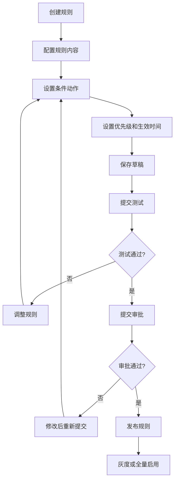
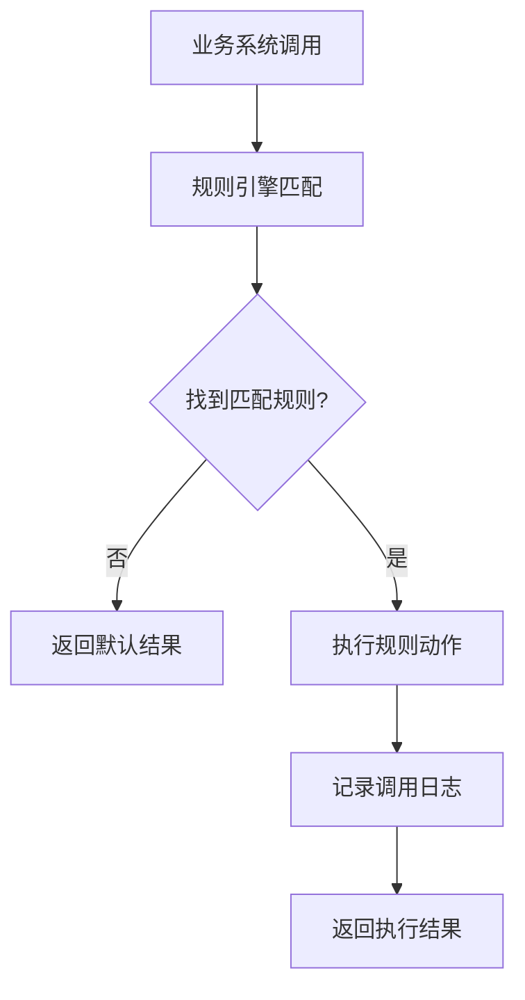

# 规则引擎中心 - 产品需求文档

## 1. 产品概述

规则引擎中心是一个面向业务人员的可视化规则配置与管理系统，用于集中管理审批、风控和运营活动中的判断规则。通过统一的规则管理平台，解决规则散落在各业务系统中的问题，提供规则的全生命周期管理能力。

核心价值：
- 降低业务人员对技术团队的依赖，实现规则自主配置
- 统一规则管理标准，减少规则冲突和重复
- 提供完善的测试、发布和监控机制，保障规则变更安全可控
- 支持按业务线分组管理，满足多业务线协同需求

目标用户：业务运营人员、风控专员、审批管理员、产品经理

## 2. 核心功能

### 2.1 用户角色

| 角色 | 描述 | 核心权限 |
|------|------|----------|
| 超级管理员 | 系统最高权限管理者 | 全部功能、系统配置、权限管理 |
| 业务线管理员 | 各业务线规则负责人 | 本业务线规则管理、测试、发布 |
| 规则编辑者 | 规则配置人员 | 规则编辑、测试、提交审批 |
| 规则审核者 | 规则变更审批人员 | 审批规则变更、版本对比 |
| 运营人员 | 规则调用方 | 查看规则、调用测试 |

### 2.2 功能模块

1. **规则列表页**：业务人员维护规则的统一入口，支持规则浏览、搜索、筛选、分组管理
2. **规则编辑器**：可视化规则配置界面，支持条件、动作、优先级等规则元素配置
3. **规则测试台**：在线模拟输入测试，查看命中结果和执行流程
4. **发布记录页**：记录规则版本历史，支持版本对比和回滚操作
5. **调用日志页**：展示规则调用记录，提供统计分析和异常告警
6. **权限管理页**：用户权限配置和业务线分组管理

## 3. 核心流程

### 3.1 规则创建与发布流程

### 3.2 规则调用流程

## 4. 页面详情

### 4.1 规则列表页

| 模块 | 功能描述 |
|------|----------|
| 业务线筛选器 | 按业务线（审批/风控/运营）筛选规则 |
| 规则状态标签 | 草稿/待审批/已发布/已停用/灰度中 |
| 规则搜索框 | 支持规则名称、规则ID搜索 |
| 高级筛选 | 按优先级、时间范围、创建人筛选 |
| 规则表格 | 展示规则列表，支持排序、分页 |
| 快捷操作 | 复制规则、编辑、删除、停用 |
| 新建规则按钮 | 跳转至规则编辑器 |

### 4.2 规则编辑器

| 模块 | 功能描述 |
|------|----------|
| 规则基本信息 | 规则名称、描述、业务线、标签 |
| 条件配置区 | 可视化条件构建器，支持AND/OR组合 |
| 动作配置区 | 动作类型、参数配置、返回值设置 |
| 优先级设置 | 数字越小优先级越高 |
| 生效时间 | 开始时间、结束时间、永久有效选项 |
| 适用范围 | 配置规则适用的业务场景 |
| 版本预览 | 实时预览规则JSON结构 |
| 保存与提交 | 保存草稿、提交测试、提交审批 |

### 4.3 规则测试台

| 模块 | 功能描述 |
|------|----------|
| 输入参数区 | 模拟业务输入参数配置 |
| 测试执行按钮 | 触发规则执行 |
| 命中结果展示 | 展示匹配到的规则及执行结果 |
| 执行流程追踪 | 展示规则执行步骤和时间消耗 |
| 冲突提示 | 展示规则冲突警告 |
| 测试历史 | 保存历史测试记录 |

### 4.4 发布记录页

| 模块 | 功能描述 |
|------|----------|
| 版本列表 | 展示所有版本及发布时间线 |
| 版本对比 | 两个版本之间的差异高亮显示 |
| 版本详情 | 查看特定版本的完整配置 |
| 回滚操作 | 将规则回滚到历史版本 |
| 变更记录 | 展示每次变更的内容和操作人 |

### 4.5 调用日志页

| 模块 | 功能描述 |
|------|----------|
| 日志搜索 | 按时间、规则ID、调用结果筛选 |
| 日志统计图 | 调用量趋势、成功率、响应时间 |
| 日志列表 | 展示详细调用记录 |
| 异常告警 | 高亮异常调用，支持告警配置 |
| 导出功能 | 导出日志到Excel/CSV |

### 4.6 权限管理页

| 模块 | 功能描述 |
|------|----------|
| 用户列表 | 展示系统用户及角色 |
| 角色配置 | 添加/编辑角色和权限 |
| 业务线分配 | 将用户分配到不同业务线 |
| 权限日志 | 记录权限变更操作 |

## 5. 用户界面设计

### 5.1 设计风格

- **设计定位**：企业级控制台，强调专业、高效、清晰
- **配色方案**：
  - 主色调：深蓝色 #1a365d（传递信任与专业）
  - 辅助色：青色 #319795（活力与创新）
  - 强调色：橙色 #dd6b20（警示与重点）
  - 成功色：绿色 #38a169
  - 背景色：浅灰 #f7fafc
- **字体选择**：
  - 标题：思源黑体 Bold / Noto Sans SC Bold
  - 正文：思源黑体 Regular / Noto Sans SC Regular
  - 代码/规则表达式：JetBrains Mono / Source Code Pro
- **布局风格**：左侧导航 + 右侧内容区，采用卡片式布局
- **图标风格**：线性图标，保持一致性和可读性

### 5.2 响应式设计

- 桌面端优先设计（最小宽度 1200px）
- 平板适配（1024px - 1199px）
- 规则编辑器和测试台保持桌面端最佳体验

### 5.3 交互动效

- 页面切换：淡入淡出效果，300ms ease-out
- 表格行悬停：高亮背景，150ms过渡
- 按钮点击：轻微缩放反馈，scale(0.98)
- 模态框弹出：从中心放大 + 背景遮罩渐显
- 数据加载：骨架屏占位，提升感知性能

## 6. 数据模型

### 6.1 核心实体

| 实体 | 描述 |
|------|------|
| 规则集 (RuleSet) | 包含多个规则的容器，按业务线分组 |
| 规则 (Rule) | 具体业务规则，包含条件和动作 |
| 规则版本 (RuleVersion) | 规则的版本快照，支持历史回溯 |
| 条件 (Condition) | 规则的触发条件，支持多级嵌套 |
| 动作 (Action) | 规则触发后执行的动作 |
| 调用记录 (CallLog) | 规则调用的详细日志 |

### 6.2 关系说明

- 一个业务线包含多个规则集
- 一个规则集包含多条规则
- 一条规则有多个版本
- 一条规则有多个条件（组合关系）
- 一条规则有多个动作（执行顺序）

## 7. 非功能性需求

### 7.1 性能要求

- 规则列表加载时间 < 2秒
- 规则测试响应时间 < 500ms
- 支持单业务线 10000+ 规则管理
- 支持同时在线 100+ 用户

### 7.2 安全要求

- 用户认证与授权
- 敏感操作审计日志
- 规则变更双人审批机制
- 数据加密存储

### 7.3 可用性要求

- 系统可用性 99.9%
- 支持 7x24 小时运行
- 故障恢复时间 < 30分钟
