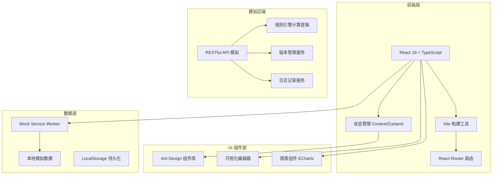

# 规则引擎中心 - 技术架构文档

## 1. 架构设计

### 1.1 系统架构图



### 1.2 技术选型

| 类别 | 技术栈 | 版本 | 说明 |
|------|--------|------|------|
| 前端框架 | React | 18.2+ | 核心框架 |
| 构建工具 | Vite | 5.0+ | 快速构建 |
| 开发语言 | TypeScript | 5.0+ | 类型安全 |
| UI 组件库 | Ant Design | 5.x | 企业级组件 |
| 路由管理 | React Router | 6.x | SPA 路由 |
| 状态管理 | Zustand | 4.x | 轻量状态管理 |
| 图表库 | ECharts | 5.x | 数据可视化 |
| 模拟服务 | MSW | 2.x | API 模拟 |
| 代码编辑器 | Monaco Editor | 0.45+ | 规则表达式编辑 |
| 拖拽排序 | dnd-kit | 6.x | 条件拖拽排序 |

## 2. 项目结构

```
rule-engine-center/
├── public/
│   └── favicon.ico
├── src/
│   ├── assets/                 # 静态资源
│   │   ├── images/
│   │   └── styles/
│   │       └── global.css       # 全局样式
│   ├── components/              # 公共组件
│   │   ├── common/              # 通用组件
│   │   ├── layout/             # 布局组件
│   │   └── rule-editor/        # 规则编辑器组件
│   ├── pages/                   # 页面组件
│   │   ├── RuleList/           # 规则列表页
│   │   ├── RuleEditor/         # 规则编辑器页
│   │   ├── RuleTest/           # 规则测试台页
│   │   ├── ReleaseHistory/     # 发布记录页
│   │   ├── CallLogs/           # 调用日志页
│   │   └── Permission/          # 权限管理页
│   ├── services/                # 服务层
│   │   ├── api/                # API 接口定义
│   │   └── mock/                # 模拟数据
│   ├── stores/                  # 状态管理
│   ├── types/                   # TypeScript 类型定义
│   ├── utils/                   # 工具函数
│   ├── App.tsx                  # 根组件
│   └── main.tsx                 # 入口文件
├── index.html
├── package.json
├── tsconfig.json
├── vite.config.ts
└── README.md
```

## 3. 路由定义

| 路由路径 | 页面组件 | 功能描述 |
|----------|----------|----------|
| `/` | 首页/Dashboard | 概览统计和快捷入口 |
| `/rules` | RuleList | 规则列表管理 |
| `/rules/new` | RuleEditor | 创建新规则 |
| `/rules/:id/edit` | RuleEditor | 编辑规则 |
| `/rules/:id/test` | RuleTest | 规则测试台 |
| `/rules/:id/history` | ReleaseHistory | 发布记录 |
| `/logs` | CallLogs | 调用日志 |
| `/permissions` | Permission | 权限管理 |
| `/settings` | Settings | 系统设置 |

## 4. 数据模型定义

### 4.1 规则 (Rule)

```typescript
interface Rule {
  id: string;
  name: string;
  description: string;
  businessLine: 'approval' | 'risk' | 'operation';
  status: 'draft' | 'pending' | 'published' | 'disabled' | 'gray';
  priority: number;
  tags: string[];
  conditions: Condition[];
  actions: Action[];
  effectiveTime: {
    startTime: string | null;
    endTime: string | null;
    permanent: boolean;
  };
  scope: {
    scenarios: string[];
    regions: string[];
  };
  version: number;
  createdAt: string;
  updatedAt: string;
  createdBy: string;
  updatedBy: string;
}
```

### 4.2 条件 (Condition)

```typescript
interface Condition {
  id: string;
  field: string;
  operator: 'eq' | 'ne' | 'gt' | 'lt' | 'gte' | 'lte' | 'contains' | 'in' | 'between';
  value: any;
  logicalOperator?: 'AND' | 'OR';
  children?: Condition[];
}
```

### 4.3 动作 (Action)

```typescript
interface Action {
  id: string;
  type: 'approve' | 'reject' | 'notify' | 'score' | 'tag' | 'route';
  params: Record<string, any>;
  order: number;
}
```

### 4.4 调用记录 (CallLog)

```typescript
interface CallLog {
  id: string;
  ruleId: string;
  ruleName: string;
  input: Record<string, any>;
  output: any;
  hitResult: 'hit' | 'miss' | 'error';
  executionTime: number;
  timestamp: string;
  error?: string;
}
```

### 4.5 用户权限 (UserPermission)

```typescript
interface User {
  id: string;
  username: string;
  name: string;
  email: string;
  role: 'super_admin' | 'admin' | 'editor' | 'reviewer' | 'operator';
  businessLines: string[];
  status: 'active' | 'inactive';
  lastLogin: string;
}
```

## 5. 模拟 API 设计

### 5.1 规则管理接口

| 接口方法 | 路径 | 描述 |
|----------|------|------|
| GET | /api/rules | 获取规则列表 |
| GET | /api/rules/:id | 获取规则详情 |
| POST | /api/rules | 创建规则 |
| PUT | /api/rules/:id | 更新规则 |
| DELETE | /api/rules/:id | 删除规则 |
| POST | /api/rules/:id/publish | 发布规则 |
| POST | /api/rules/:id/disable | 停用规则 |
| POST | /api/rules/:id/rollback | 回滚规则 |
| POST | /api/rules/:id/copy | 复制规则 |
| POST | /api/rules/:id/test | 测试规则 |

### 5.2 调用日志接口

| 接口方法 | 路径 | 描述 |
|----------|------|------|
| GET | /api/logs | 获取调用日志列表 |
| GET | /api/logs/stats | 获取调用统计 |
| GET | /api/logs/alerts | 获取告警列表 |

### 5.3 权限管理接口

| 接口方法 | 路径 | 描述 |
|----------|------|------|
| GET | /api/users | 获取用户列表 |
| POST | /api/users | 创建用户 |
| PUT | /api/users/:id | 更新用户 |
| DELETE | /api/users/:id | 删除用户 |
| GET | /api/roles | 获取角色列表 |
| POST | /api/roles | 创建角色 |

## 6. 核心模块设计

### 6.1 规则编辑器模块

**功能**：
- 可视化条件构建器
- 动作配置面板
- 规则预览与验证
- 版本比较功能

**关键组件**：
- `ConditionBuilder`：条件构建器主组件
- `ConditionGroup`：条件组容器，支持嵌套
- `ConditionItem`：单个条件项
- `ActionPanel`：动作配置面板
- `RulePreview`：规则预览组件

### 6.2 规则测试模块

**功能**：
- 输入参数配置
- 规则执行与结果展示
- 执行流程追踪
- 冲突检测与提示

**关键组件**：
- `TestInputPanel`：测试输入配置
- `TestResultPanel`：测试结果展示
- `ExecutionFlow`：执行流程追踪
- `ConflictAlert`：冲突提示

### 6.3 版本管理模块

**功能**：
- 版本历史记录
- 版本对比展示
- 版本回滚操作
- 变更记录追踪

### 6.4 调用日志模块

**功能**：
- 日志查询与筛选
- 调用统计分析
- 异常告警配置
- 日志导出功能

**关键组件**：
- `LogTable`：日志列表
- `LogChart`：统计图表
- `AlertConfig`：告警配置
- `LogExport`：导出功能

## 7. 状态管理设计

使用 Zustand 进行状态管理，主要 store：

```typescript
// 规则 Store
interface RuleStore {
  rules: Rule[];
  currentRule: Rule | null;
  loading: boolean;
  filters: RuleFilters;
  fetchRules: () => Promise<void>;
  createRule: (rule: Rule) => Promise<void>;
  updateRule: (id: string, rule: Rule) => Promise<void>;
  deleteRule: (id: string) => Promise<void>;
}

// 用户权限 Store
interface UserStore {
  currentUser: User | null;
  users: User[];
  permissions: Permission[];
  fetchUsers: () => Promise<void>;
  updateUserRole: (id: string, role: string) => Promise<void>;
}

// 调用日志 Store
interface LogStore {
  logs: CallLog[];
  stats: CallStats;
  alerts: Alert[];
  fetchLogs: (params: LogQuery) => Promise<void>;
  fetchStats: () => Promise<void>;
}
```

## 8. Mock 数据结构

### 8.1 规则数据

```typescript
const mockRules: Rule[] = [
  {
    id: 'rule-001',
    name: '高风险用户审批',
    description: '针对高风险用户进行额外审批',
    businessLine: 'risk',
    status: 'published',
    priority: 1,
    tags: ['高风险', '审批'],
    conditions: [
      {
        id: 'cond-001',
        field: 'user.riskLevel',
        operator: 'eq',
        value: 'high'
      }
    ],
    actions: [
      {
        id: 'action-001',
        type: 'notify',
        params: { recipients: ['risk-team'], message: '高风险用户审批' },
        order: 1
      }
    ],
    effectiveTime: {
      startTime: '2024-01-01',
      endTime: null,
      permanent: true
    },
    scope: {
      scenarios: ['loan', 'credit'],
      regions: ['全国']
    },
    version: 3,
    createdAt: '2024-01-15T10:30:00Z',
    updatedAt: '2024-03-20T14:20:00Z',
    createdBy: 'admin',
    updatedBy: 'risk-admin'
  }
];
```

### 8.2 调用日志数据

```typescript
const mockLogs: CallLog[] = [
  {
    id: 'log-001',
    ruleId: 'rule-001',
    ruleName: '高风险用户审批',
    input: { userId: 'user-123', riskLevel: 'high', amount: 50000 },
    output: { action: 'notify', status: 'success' },
    hitResult: 'hit',
    executionTime: 45,
    timestamp: '2024-03-25T15:30:00Z'
  }
];
```

## 9. 样式设计系统

### 9.1 颜色变量

```css
:root {
  --color-primary: #1a365d;
  --color-secondary: #319795;
  --color-accent: #dd6b20;
  --color-success: #38a169;
  --color-warning: #d69e2e;
  --color-error: #e53e3e;
  --color-bg: #f7fafc;
  --color-bg-card: #ffffff;
  --color-text-primary: #1a202c;
  --color-text-secondary: #718096;
  --color-border: #e2e8f0;
}
```

### 9.2 字体系统

```css
:root {
  --font-family-display: 'Noto Sans SC', 'Source Han Sans SC', sans-serif;
  --font-family-body: 'Noto Sans SC', 'Source Han Sans SC', sans-serif;
  --font-family-mono: 'JetBrains Mono', 'Source Code Pro', monospace;
  
  --font-size-xs: 12px;
  --font-size-sm: 14px;
  --font-size-base: 16px;
  --font-size-lg: 18px;
  --font-size-xl: 20px;
  --font-size-2xl: 24px;
  --font-size-3xl: 30px;
}
```

### 9.3 间距系统

```css
:root {
  --spacing-xs: 4px;
  --spacing-sm: 8px;
  --spacing-md: 16px;
  --spacing-lg: 24px;
  --spacing-xl: 32px;
  --spacing-2xl: 48px;
}
```

## 10. 性能优化策略

- **路由懒加载**：使用 React.lazy 进行页面级代码分割
- **组件缓存**：使用 React.memo 避免不必要的重渲染
- **虚拟列表**：长列表使用虚拟滚动优化
- **防抖节流**：搜索和筛选使用防抖处理
- **骨架屏**：数据加载时显示骨架屏提升体验
